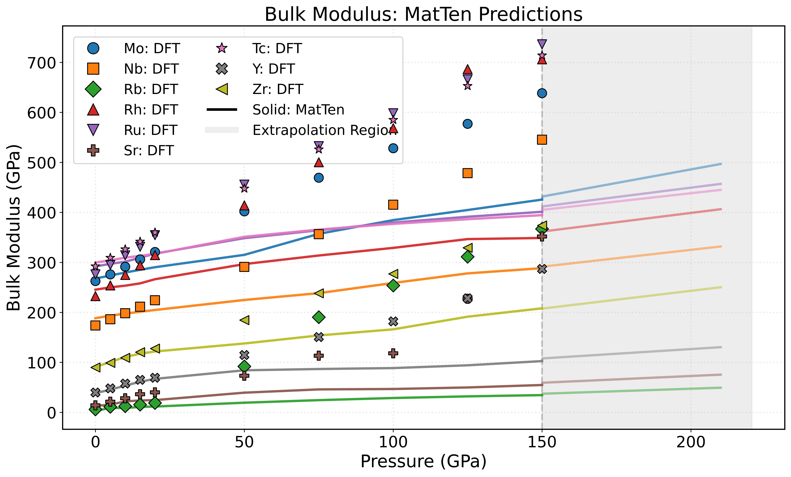
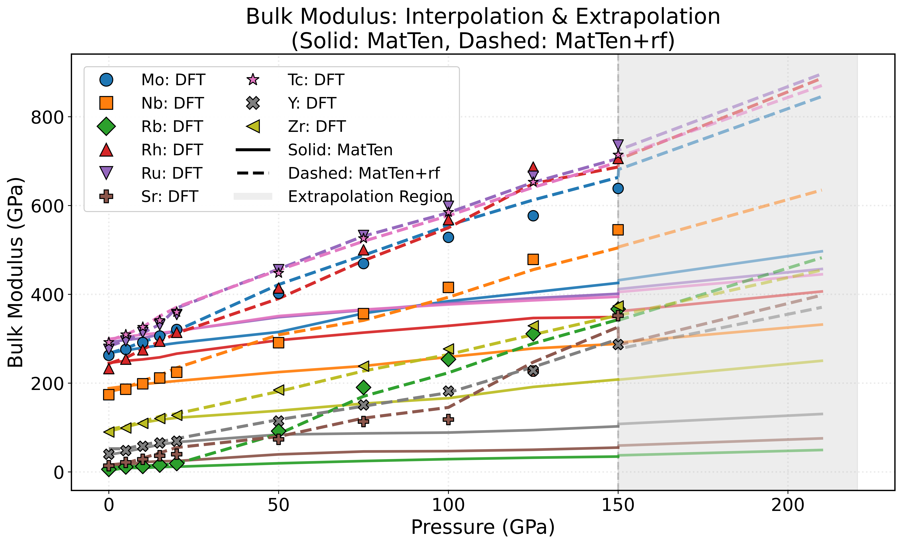
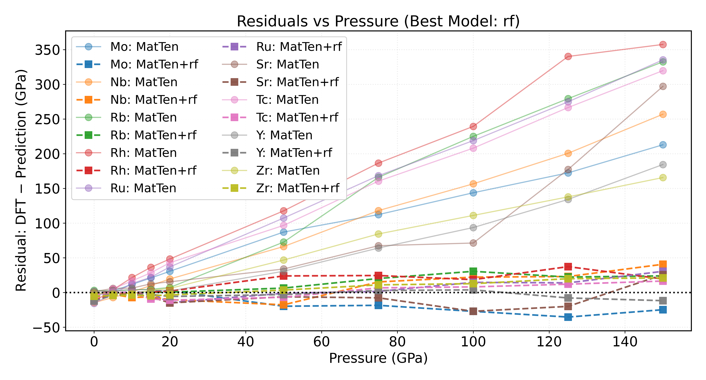
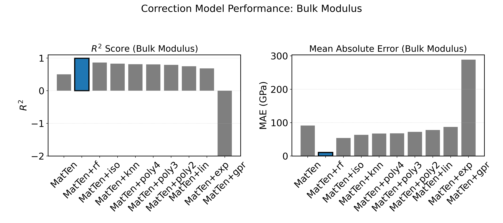
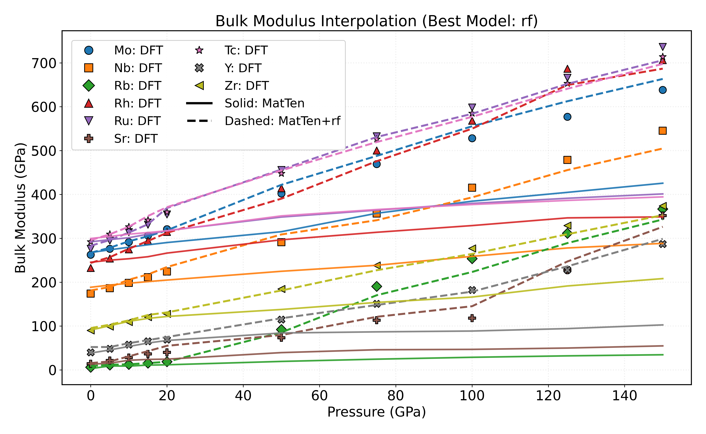

# Bulk Modulus Prediction Using MatTen GNN with Machine Learning Corrections

---

This repository provides a reproducible workflow for predicting the pressure-dependent bulk modulus of elemental crystalline solids. It combines **MatTen**, an equivariant Graph Neural Network (GNN), with a suite of regression-based correction models to enhance its predictions. The primary goal is to offer a high-throughput, accurate, and physically meaningful approach for elastic property prediction across varying pressure conditions, directly supporting computational materials science and informatics.

---

## Table of Contents

* [Overview](#overview)
* [Scientific Motivation](#scientific-motivation)
* [Dataset Description](#dataset-description)
* [Methodology](#methodology)
    1.  [MatTen GNN Elastic Tensor Prediction](#1-marten-gnn-elastic-tensor-prediction)
    2.  [Bulk Modulus Calculation](#2-bulk-modulus-calculation)
    3.  [Regression-Based Correction Models](#3-regression-based-correction-models)
* [Results and Analysis](#results-and-analysis)
    * [Prediction Accuracy](#prediction-accuracy)
    * [Extrapolation, Robustness, and Trends](#extrapolation-robustness-and-trends)
    * [Physical Interpretation](#physical-interpretation)
* [Limitations](#limitations)
* [Usage Instructions](#usage-instructions)
* [Future Directions](#future-directions)
* [Contact](#contact)
* [References](#references)
* [Acknowledgments](#acknowledgments)

---

## Overview

This project presents a data-driven approach to predict the **bulk modulus**—a fundamental mechanical property—of elemental crystals as a function of applied pressure. By integrating **MatTen**, an equivariant GNN designed for tensorial properties, with regression-based corrections, this workflow significantly reduces the computational cost compared to direct DFT calculations, while maintaining high accuracy and physical interpretability.

---

## Scientific Motivation

Elastic moduli, particularly the bulk modulus, are crucial for understanding the mechanical behavior and phase stability of solids under extreme conditions. While traditional quantum-mechanical simulations (e.g., Density Functional Theory - DFT) offer reliable results, they are computationally prohibitive for systematic studies across a wide range of compositions and pressure conditions.

Recent advancements in machine learning, especially physically-informed Graph Neural Networks, offer a promising avenue for rapid property prediction. However, pre-trained GNNs may exhibit systematic biases when applied to new domains or under extrapolation. This work addresses these challenges by:

* Quantifying the performance of the **MatTen** GNN for elemental systems under pressure.
* Applying machine learning regression models to correct systematic errors and calibrate predictions against DFT data.
* Evaluating the model's performance for both **interpolation** (within DFT-sampled pressure ranges) and **extrapolation** (beyond those ranges).

---

## Dataset Description

This project utilizes a custom dataset of elemental crystal structures evaluated at various pressures. This dataset is specifically designed for benchmarking and developing machine learning models for elastic property prediction, such as the bulk modulus.

* **Systems:** A diverse range of elemental crystals (e.g., Fe, Cr, Mn, Mo, Nb, Rh, Ru, Sr, Tc, Y, Zr, Rb), each evaluated under hydrostatic pressure.
* **Pressure Range:** Typically spans from 0 to 200 GPa, with data sampled at discrete intervals for each system.
* **Properties per Entry:** Each entry includes:
    * **POSCAR:** Atomic structure in standard VASP format.
    * **target.json:** DFT-computed physical properties, notably:
        * `"bulk_modulus"` (in GPa, the primary target property for ML).
        * `"elastic_tensor"` (6x6 Voigt matrix).
        * Additional fields such as pressure, free energy, ELF descriptors, and lattice constants.
* **MatTen Model Pre-training:** The **MatTen** GNN model is pre-trained on a comprehensive dataset of 10,276 elasticity tensors from the Materials Project. This pre-training utilizes an 8:1:1 train/validation/test split, ensuring robust generalization.

This integrated dataset, combining quantum-computed properties with standardized structure files, forms a robust foundation for data-driven elastic property prediction and model evaluation.

### Data Organization and Format

The dataset should be organized into the following directory structure:
gnn_dataset/
├── Mo_0.0GPa/
│   ├── POSCAR
│   └── target.json
├── Mo_10.0GPa/
│   ├── POSCAR
│   └── target.json
├── Nb_0.0GPa/
│   ├── POSCAR
│   └── target.json
...

* **Naming Convention:** Each subdirectory is named as `{ElementSymbol}_{Pressure}GPa` (e.g., `Mo_0.0GPa` for molybdenum at 0 GPa).
* **File Contents:**
    * **POSCAR:** VASP format crystal structure.
    * **target.json:** DFT-computed properties and physical descriptors.

---

## Methodology

### 1. MatTen GNN Elastic Tensor Prediction

**MatTen** is utilized to predict the full elasticity tensor from the crystal structure.

* **Feature Construction:** Atomic positions are encoded as displacement vectors, and atomic species are represented as one-hot vectors.
* **Network Architecture:** The model employs multiple equivariant GNN layers to capture spatial symmetries and interactions. Radial basis functions and spherical harmonics ensure geometric expressiveness, while interaction blocks update atomic features through tensor operations and normalization.
* **Output:** The network directly outputs a full 6x6 Voigt matrix elasticity tensor, designed to inherently respect symmetry constraints. This ensures that predictions are structure-aware and physically plausible, even for systems not explicitly present in the training set.

### 2. Bulk Modulus Calculation

The bulk modulus is derived from the predicted elasticity tensor.

* **Mathematical Expression:** The bulk modulus ($K$) here (for cubic system) is calculated as:

    $$K = \frac{C_{11} + 2(C_{12} )}{3}$$

* **Interpretation:** The Voigt average is a standard method for estimating isotropic moduli from full tensors, particularly suitable for polycrystalline or randomly oriented systems.

### 3. Regression-Based Correction Models

Following the **MatTen** prediction, several supervised machine learning regressors are trained to correct the predicted bulk moduli against the DFT reference data.

* **Regression Models Evaluated:**
    * **Linear Regression:** For capturing global linear relationships.
    * **Polynomial Regression:** To capture systematic nonlinear deviations (tested with degrees 2–4).
    * **Isotonic Regression:** Ideal for monotonic but potentially nonlinear relationships.
    * **k-Nearest Neighbors:** To capture local data structures.
    * **Random Forest Regression:** For modeling complex, nonlinear dependencies and reducing overfitting.
    * **Gaussian Process Regression:** Provides both predictions and uncertainty quantification.
    * **Exponential Regression:** To investigate potential log-scale or exponential relationships.
* **Features:** The input features for these correction models include:
    * The **MatTen**-predicted bulk modulus.
    * Pressure.
    * Tensor norm (characterizing the overall elastic response).
* **Model Selection and Validation:** Hyperparameters are optimized using cross-validation and grid search. Models are rigorously evaluated based on $R^2$ (coefficient of determination) and MAE (Mean Absolute Error).

---

## Results and Analysis

### Prediction Accuracy

Our initial **MatTen** predictions showed a strong correlation ($R^2 \approx 0.9$) with DFT reference data. However, we observed systematic over- or under-predictions, indicating a domain gap between the Materials Project pre-training data and our specific pressure-dependent elemental systems.

**Figure 1: Initial MatTen Prediction vs. DFT Bulk Modulus**

*This scatter plot compares raw MatTen-predicted bulk modulus values against DFT-computed values, illustrating the initial correlation and systematic deviations from the ideal $y=x$ line.*

The application of machine learning correction models, particularly **Random Forest** or **Polynomial Regression**, significantly enhanced prediction accuracy. We achieved an impressive $R^2 \ge 0.98$ and a Mean Absolute Error (MAE) as low as 1–3 GPa, effectively addressing the identified domain gap.

**Figure 2: ML-Corrected Prediction vs. DFT Bulk Modulus**

*This figure demonstrates the enhanced accuracy post-correction, showing data points significantly tighter around the $y=x$ line and a substantial reduction in prediction error.*

Post-correction, residuals (DFT - prediction) were minimized and exhibited no significant pressure-dependent drift, confirming the effectiveness of the corrections in removing systematic biases.

**Figure 3: Residual Comparison: Raw MatTen vs. Best Corrected**

*This plot clearly contrasts the residual distribution before and after correction, visually confirming the successful minimization of errors.*

Performance metrics for all evaluated models are detailed in `results_ml_ecs/bulkmod_correction_metrics.csv`.

**Figure 4: $R^2$ Comparison of Correction Models**

*This chart provides a direct comparison of the $R^2$ values across different correction models, showcasing their respective performance.*

### Extrapolation, Robustness, and Trends

Within the observed DFT-sampled pressure ranges, the corrected models closely matched DFT data, exhibiting small residuals and no evidence of overfitting. This confirms our pipeline's robust **interpolation** capabilities.

Furthermore, the developed pipeline demonstrates the ability to **extrapolate** trends beyond the available DFT data. **MatTen's** inherent physical plausibility ensures reasonable physical behavior (e.g., monotonic increase or decrease in bulk modulus under compression) even in extrapolated regions.

**Figure 5: Pressure-Dependent Bulk Modulus for Selected Elements (Interpolation & Extrapolation)**

*This plot effectively illustrates the model's ability to accurately track DFT data within the sampled range and extend these trends into unobserved pressure regimes, maintaining physical consistency.*

While promising, it's crucial to validate extrapolated predictions with new DFT data or expert physical reasoning, as ML corrections may become less reliable far outside the training domain. Overall, the workflow successfully captures distinct pressure dependencies and structural characteristics across various elemental systems.

### Physical Interpretation

The primary source of residual error stemmed from the domain mismatch between **MatTen's** pre-training data and the specific pressure/structure combinations in the current dataset. The effectiveness of regression corrections indicates these errors were largely systematic rather than random.

This approach enables rapid screening of elastic properties for materials discovery and design under varying environmental conditions. It supports experimental prioritization and hypothesis generation by providing fast, accurate, and physically interpretable predictions.

## Limitations

* The current dataset is limited to elemental solids; extending the methodology to multicomponent systems will require further validation and potentially retraining.
* The reliability of ML corrections is inherently tied to the quality and coverage of the underlying DFT reference data across the relevant phase space.
* The physical interpretability of ML corrections may be limited, especially for highly nonlinear relationships or outlier cases.

---

## Dependencies 
* numpy, pandas, matplotlib
* scikit-learn
* pymatgen
* matten 

---

## Future Directions

* Multi-property predictions (e.g., elastic anisotropy, higher-order moduli)
* Transfer learning to alloys, compounds, or disordered systems
* Uncertainty quantification for risk-aware materials discovery
* Active learning and feedback with on-the-fly DFT
* Scaling up to larger, more diverse datasets

---

## Contact
Abhiyan Pandit

---

## References

https://github.com/wengroup/matten

---

